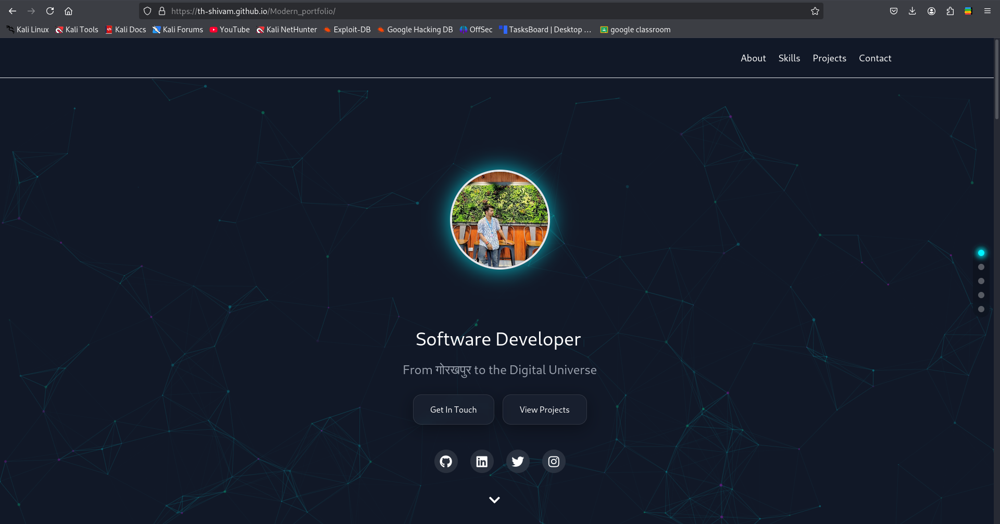
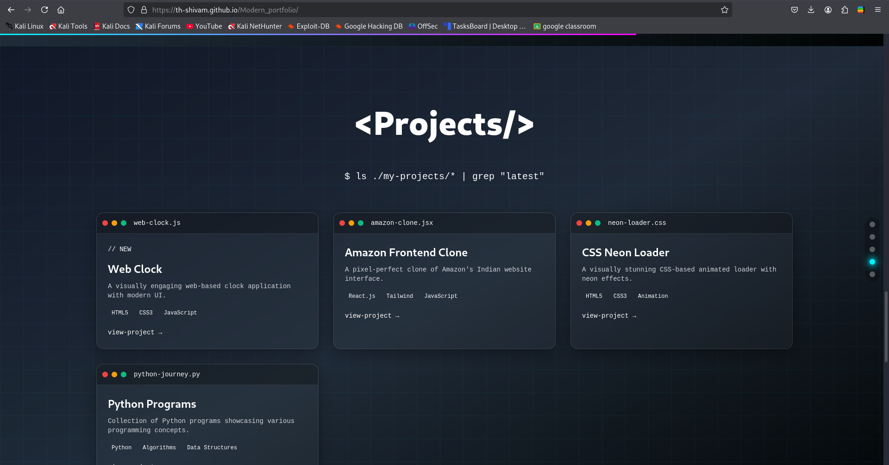

# 🌐 Modern Portfolio Website

Welcome to my personal portfolio website! 🚀 This project showcases my skills, projects, and professional journey as a developer. It is designed to reflect my passion for technology and my commitment to creating sleek, modern, and responsive web applications.

## 🖥️ Live Demo
[Visit My Portfolio](https://th-shivam.github.io/Modern_portfolio/) 🌟

## 📌 Features
- **Responsive Design**: Fully optimized for all devices—desktop, tablet, and mobile.
- **Modern Aesthetics**: Clean and elegant UI with intuitive navigation.
- **Tech Showcase**: Highlights my skills in web development, programming, and other technologies.
- **Projects Section**: A curated collection of my top projects with links to GitHub repos.
- **Contact Form**: Easily reach out to me through an integrated contact section.
- **Social Links**: Connect with me on LinkedIn, X, and Instagram.

## 🛠️ Technologies Used
- **Frontend**: HTML5, CSS3, JavaScript, Tailwind CSS
- **Hosting**: Github

## 🖼️ Screenshots



## 🚀 How to Use
1. Clone this repository:
   ```bash
   git clone https://github.com/th-shivam/modern_portfolio.git

    Navigate to the project directory:

    cd modern_portfolio

    Open index.html in your browser to view the website.

✨ Contributing

I’m always open to feedback and suggestions to improve my portfolio! If you'd like to contribute:

    Fork this repository.
    Create a new branch:

git checkout -b feature-name

Commit your changes:

git commit -m "Added a new feature"

Push to the branch:

    git push origin feature-name

    Open a Pull Request.

📬 Contact

Feel free to connect with me:

    📧 Email: dreamyshivam01@gmail.com
    🌐 LinkedIn: Shivam Singh
    🐦 X: @dreamyshivam
    📸 Instagram: @ryzen_shivam

Thank you for visiting my portfolio! 😊 Feel free to explore and connect with me.


### Key Elements Included:
- **Live Demo Link**: Replace `https://th-shivam.github.io/Modern_portfolio/` with your website URL.
- **Features**: Highlight key elements of your portfolio.
- **Technologies Used**: Mention the tools and frameworks you’ve used.
- **How to Use**: Instructions for running the project locally.
- **Screenshots**: Add relevant screenshots in a `screenshots` folder in your repo.
- **Contact Section**: Includes all your social media and email links.

This will help present your project professionally. Let me know if you'd like further customization! 😊
